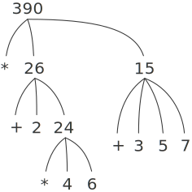

One of our goals in this chapter is to isolate issues about thinking
procedurally. As a case in point, let us consider that, in evaluating
combinations, the interpreter is itself following a procedure.

> To evaluate a combination, do the following:
>
> 1.  Evaluate the subexpressions of the combination.
> 2.  Apply the procedure that is the value of the leftmost
>     subexpression (the operator) to the arguments that are the values
>     of the other subexpressions (the operands).

Even this simple rule illustrates some important points about processes
in general. First, observe that the first step dictates that in order to
accomplish the evaluation process for a combination we must first
perform the evaluation process on each element of the combination. Thus,
the evaluation rule is _recursive_ in nature; that is, it includes, as
one of its steps, the need to invoke the rule itself.[^¹⁰]

Notice how succinctly the idea of recursion can be used to express what,
in the case of a deeply nested combination, would otherwise be viewed as
a rather complicated process. For example, evaluating

```lisp
(* (+ 2 (* 4 6)) (+ 3 5 7))
```

requires that the evaluation rule be applied to four different
combinations. We can obtain a picture of this process by representing
the combination in the form of a tree, as shown in [Figure
1.1](#Figure-1_002e1). Each combination is represented by a node with
branches corresponding to the operator and the operands of the
combination stemming from it. The terminal nodes (that is, nodes with no
branches stemming from them) represent either operators or numbers.
Viewing evaluation in terms of the tree, we can imagine that the values
of the operands percolate upward, starting from the terminal nodes and
then combining at higher and higher levels. In general, we shall see
that recursion is a very powerful technique for dealing with
hierarchical, treelike objects. In fact, the “percolate values upward”
form of the evaluation rule is an example of a general kind of process
known as _tree accumulation_.



**Figure 1.1:** Tree representation, showing the value of each
subcombination.

Next, observe that the repeated application of the first step brings us
to the point where we need to evaluate, not combinations, but primitive
expressions such as numerals, built-in operators, or other names. We
take care of the primitive cases by stipulating that

- the values of numerals are the numbers that they name,
- the values of built-in operators are the machine instruction
  sequences that carry out the corresponding operations, and
- the values of other names are the objects associated with those
  names in the environment.

We may regard the second rule as a special case of the third one by
stipulating that symbols such as `+` and `*` are also included in the
global environment, and are associated with the sequences of machine
instructions that are their “values.” The key point to notice is the
role of the environment in determining the meaning of the symbols in
expressions. In an interactive language such as Lisp, it is meaningless
to speak of the value of an expression such as `(+ x 1)` without
specifying any information about the environment that would provide a
meaning for the symbol `x` (or even for the symbol `+`). As we shall see
in [Chapter 3](Chapter-3.xhtml#Chapter-3), the general notion of the
environment as providing a context in which evaluation takes place will
play an important role in our understanding of program execution.

Notice that the evaluation rule given above does not handle definitions.
For instance, evaluating `(define x 3)` does not apply `define` to two
arguments, one of which is the value of the symbol `x` and the other of
which is 3, since the purpose of the `define` is precisely to associate
`x` with a value. (That is, `(define x 3)` is not a combination.)

Such exceptions to the general evaluation rule are called _special
forms_. `Define` is the only example of a special form that we have seen
so far, but we will meet others shortly. Each special form has its own
evaluation rule. The various kinds of expressions (each with its
associated evaluation rule) constitute the syntax of the programming
language. In comparison with most other programming languages, Lisp has
a very simple syntax; that is, the evaluation rule for expressions can
be described by a simple general rule together with specialized rules
for a small number of special forms.[^¹¹]

[^¹⁰]:
    It may seem strange that the evaluation rule says, as part
    of the first step, that we should evaluate the leftmost element of a
    combination, since at this point that can only be an operator such as
    `+` or `*` representing a built-in primitive procedure such as addition
    or multiplication. We will see later that it is useful to be able to
    work with combinations whose operators are themselves compound
    expressions.

[^¹¹]:
    Special syntactic forms that are simply convenient
    alternative surface structures for things that can be written in more
    uniform ways are sometimes called _syntactic sugar_, to use a phrase
    coined by Peter Landin. In comparison with users of other languages,
    Lisp programmers, as a rule, are less concerned with matters of syntax.
    (By contrast, examine any Pascal manual and notice how much of it is
    devoted to descriptions of syntax.) This disdain for syntax is due
    partly to the flexibility of Lisp, which makes it easy to change surface
    syntax, and partly to the observation that many “convenient” syntactic
    constructs, which make the language less uniform, end up causing more
    trouble than they are worth when programs become large and complex. In
    the words of Alan Perlis, “Syntactic sugar causes cancer of the
    semicolon.”
